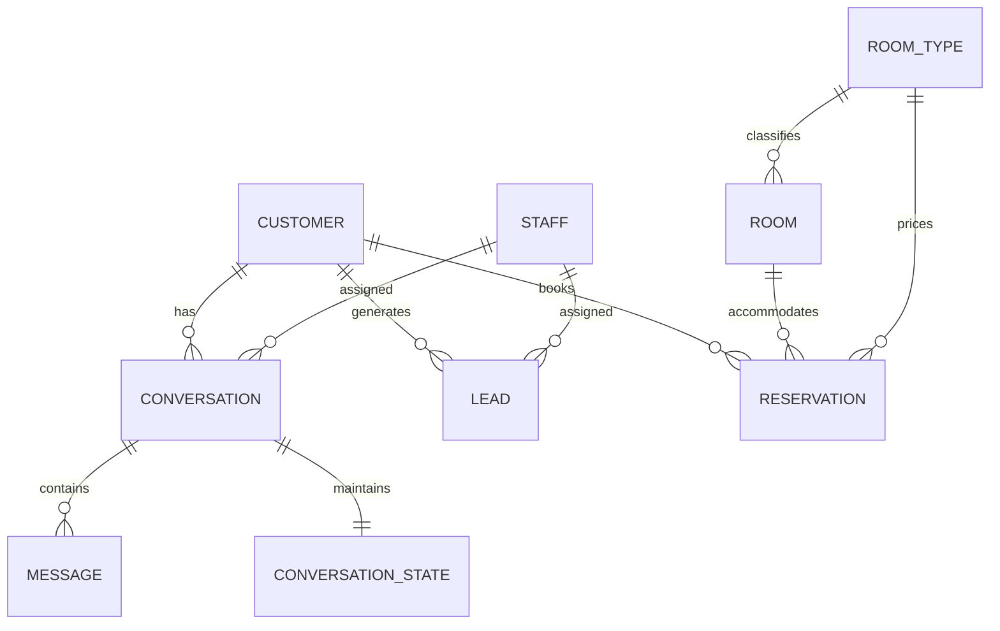

# Database Architecture & Schema Documentation

The system uses **Prisma ORM** with a relational data model designed for high-concurrency hospitality messaging and CRM workflows.

---

## 1. Database Schema Overview



### Table Definitions

1. **`Customer`**:
   - `id`, `name`, `phone`, `email`, `whatsappId`, `messengerId`, `instagramId`, `firstChannel`, `notes`.
   - Unified identity record merging guests across multiple touchpoints.

2. **`Lead`**:
   - `id`, `customerId`, `name`, `phone`, `email`, `channel`, `source`, `campaign`, `campaignId`, `adset`, `ad`.
   - `checkIn`, `checkOut`, `adults`, `children`, `roomType`, `roomsRequested`, `estimatedValue`.
   - `leadStatus` (`NEW`, `CONTACTED`, `QUALIFIED`, `HIGH_INTENT`, `BOOKING_REQUEST`, `CONFIRMED`, `LOST`, `CLOSED`).
   - `scoreReason` (Explains why lead is tagged High Intent).

3. **`Conversation`**:
   - `id`, `customerId`, `channel`, `status`, `mode` (`BOT` vs `HUMAN`), `language` (`en`, `ne`, `hi`).
   - `lastMessageAt`, `unreadStaff`, `summary`, `notes`.

4. **`Message`**:
   - `id`, `conversationId`, `direction` (`INBOUND` vs `OUTBOUND`), `messageType`, `content`, `externalMessageId`, `isStaffReply`.
   - Unique index on `externalMessageId` ensures idempotency and zero duplicate messages.

5. **`ConversationState`**:
   - `currentStep` (`GREETING`, `AWAITING_DATES`, `AWAITING_GUESTS`, `CONFIRMING_SUMMARY`, `HANDOVER`, `COMPLETE`).
   - Transient state preserving travel dates, guest count, and selected room preference without repetitive prompts.

6. **`RoomType` & `Room`**:
   - Stores the active 6 sellable guest rooms (`201`–`203`, `301`–`303`).
   - Explicitly models Room `102` (`isSellable = false`, `isSharedKitchen = true`).
   - Stored dynamic starting prices: Deluxe ($20), Budget Family ($20), Family ($30).

7. **`KnowledgeBase` & `HotelSetting`**:
   - Grounded facts, policies, anti-hallucination rules, booking links, and multilingual greeting templates.

---

## 2. SQLite (Local Development) vs PostgreSQL / Supabase (Production)

### Local Development (SQLite)
By default, the project is configured for zero-config local development using SQLite:
```prisma
datasource db {
  provider = "sqlite"
  url      = env("DATABASE_URL")
}
```
Connection string in `.env`:
```env
DATABASE_URL="file:./dev.db"
```

### Switching to Supabase / PostgreSQL for Production
1. Create a project on [Supabase](https://supabase.com/).
2. In **Project Settings** → **Database**, copy your connection string.
3. Update `prisma/schema.prisma`:
   ```prisma
   datasource db {
     provider = "postgresql"
     url      = env("DATABASE_URL")
   }
   ```
4. Update `.env` or Vercel environment variables:
   ```env
   DATABASE_URL="postgresql://postgres:[YOUR-PASSWORD]@[YOUR-HOST]:5432/postgres?schema=public"
   ```
5. Deploy schema and seed:
   ```bash
   npx prisma db push
   npx tsx prisma/seed.ts
   ```

---

## 3. Database Backup & Maintenance

To create a backup of your local SQLite database:
```bash
copy dev.db dev.db.backup
```

For Supabase:
- Automated daily backups are provided under **Database** → **Backups**.
- You can also export with pg_dump:
  ```bash
  pg_dump -d "your_postgres_connection_string" -f backup.sql
  ```
